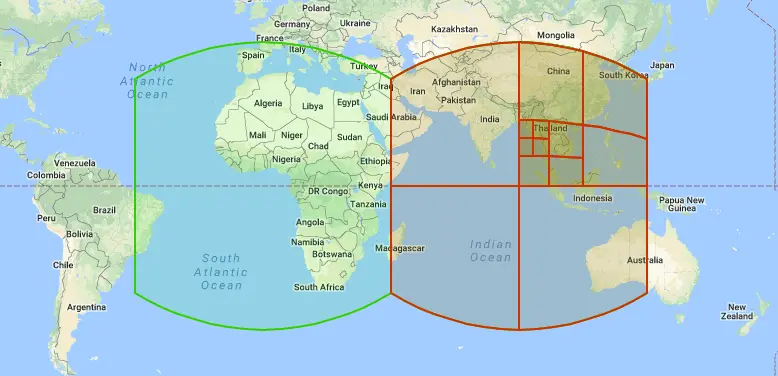
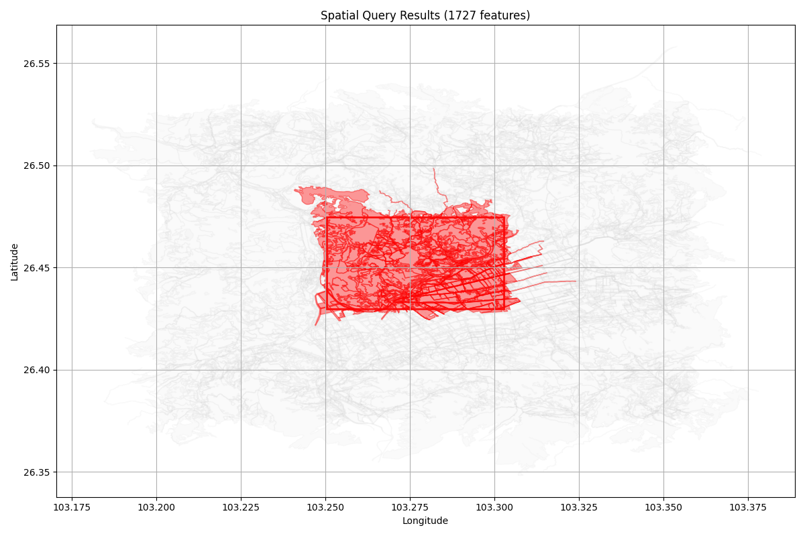
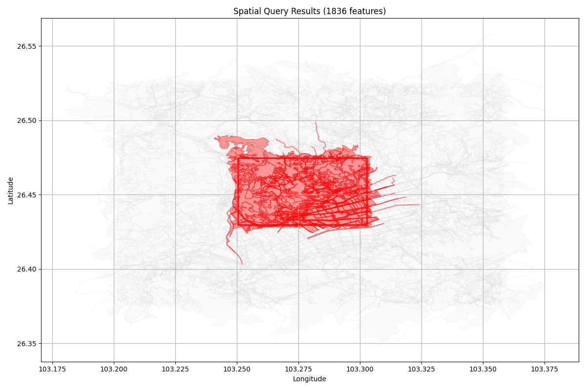
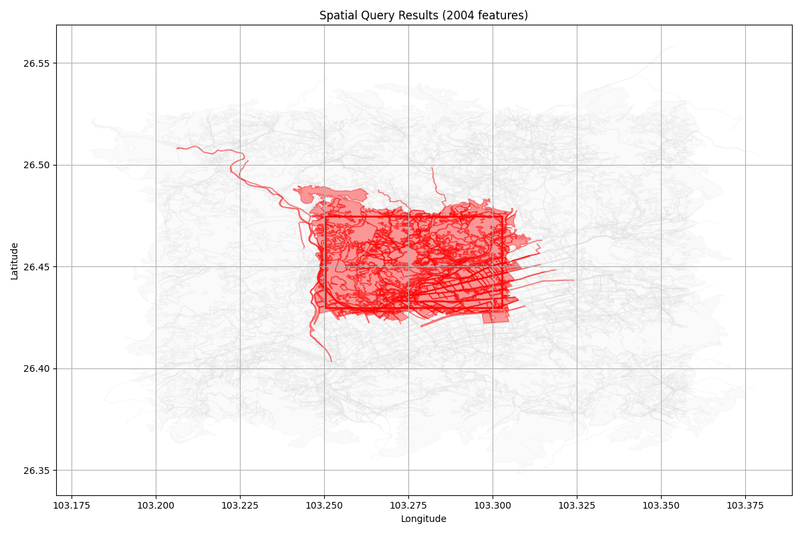
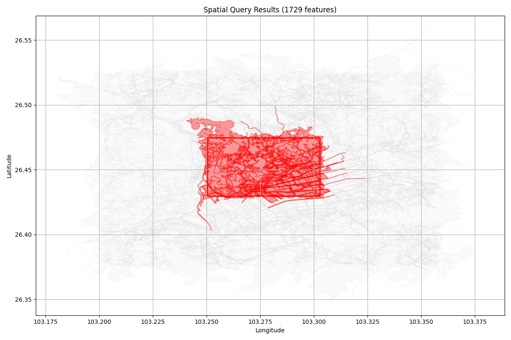
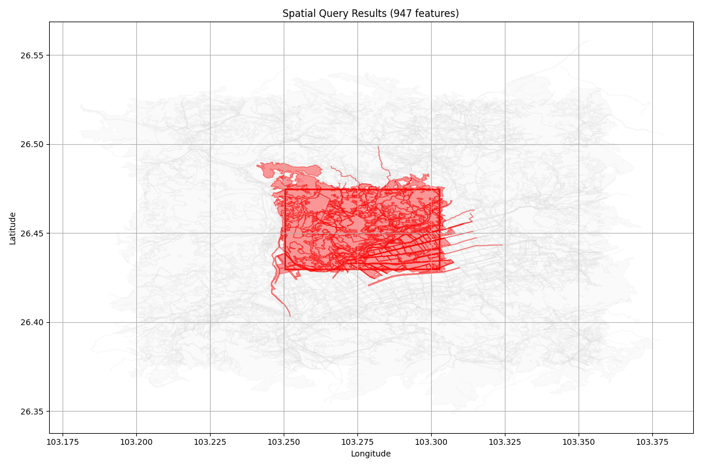

# 空间索引大比拼：H3、GeoHash 和 S2 哪个更适合你的GIS应用？



在地理信息系统（GIS）应用中，快速检索空间数据是核心需求之一。传统的顺序扫描方式虽然简单直接，但随着数据量增长，性能问题日益凸显，为此寻求高效的空间索引方式很有必要。地理空间索引：Geohash，Google S2与Uber H3[https://zhuanlan.zhihu.com/p/27262305853]这篇文中做了GeoHash和S2，以及H3的概要介绍，本文重点是通过代码实践来探索三种主流的空间索引技术，对比3种索引方式，并给出测试结果。

## 为什么要使用空间索引？

空间索引是一种优化空间查询的技术，能够显著提升地理数据的检索效率。想象一下，如果你需要在包含百万级地理要素的数据集中查找某个区域内的所有要素，使用传统的逐个比对方法可能需要数秒甚至更长时间。而通过空间索引，这个过程可以缩短到毫秒级别。

## 三种空间索引技术简介

### GeoHash：经典的矩形网格编码

GeoHash 是一种将经纬度编码为字符串的技术，通过递归划分地球表面为矩形网格来实现空间索引。它的实现简单，易于理解。

### S2：Google 的球面几何库

S2 是 Google 开发的用于球面几何计算的库，它将球面划分为层次化的四边形单元格。S2 在处理球面几何方面具有很高的精度和效率。

### H3：Uber 开源的六边形网格系统

H3 是 Uber 开发的一种分层六边形网格系统。它将地球表面划分为不同分辨率的六边形单元格，具有无极点变形、均匀面积等优点。

## 实现方案与测试设计

我们为每种索引技术实现了基于文件的索引系统，并结合 R 树进行二次优化：

1. **主索引构建**：使用 H3/GeoHash/S2 对每个地理要素建立索引
2. **辅助索引**：使用 R 树存储要素边界框，用于快速过滤
3. **精确验证**：对候选结果进行边界框精确匹配

测试数据包含多种类型的地理要素（点、线、面）。

## 性能测试结果

我们设计了五种不同的查询策略进行对比：

| 测试方案 | 描述                                 |
| -------- | ------------------------------------ |
| 方案1    | 纯 GDAL 顺序扫描（传统方法）         |
| 方案2    | 仅使用主索引（无精确验证）           |
| 方案3    | 主索引 + 矩形边界精确验证            |
| 方案4    | 主索引 + R 树优化                    |
| 方案5    | 主索引 + R 树优化 + 矩形边界精确验证 |


使用GDAL的空间过滤效果如下：



### GeoHash 索引构建核心代码

```python
# 示例：GeoHash 索引构建核心代码
def build_index(self):
    for feature in layer:
        fid = feature.GetFID()
        geom = feature.GetGeometryRef()
        env = geom.GetEnvelope()
        min_lon, max_lon, min_lat, max_lat = env
        bounds = (min_lon, min_lat, max_lon, max_lat)
        
        # 计算覆盖区域的 GeoHash 列表
        covering_hashes = bbox_to_geohashes(bounds, self.precision)
        
        for h in covering_hashes:
            self.geohash_index[h].append(fid)
```

```
===== 性能测试开始 =====

[测试1] 纯GDAL顺序扫描:
耗时: 55.36ms, 结果数: 1727
可视化结果已保存为纯GDAL顺序扫描索引.png

[测试2] 纯geohash索引 (无精确验证):
查询完成! 耗时: 4.87ms
候选要素: 1836, 结果要素: 1836
总耗时: 4.92ms
可视化结果已保存为纯geohash索引.png

[测试3] geohash + 矩形精确验证:
查询完成! 耗时: 5.26ms
候选要素: 1836, 结果要素: 1729
总耗时: 5.31ms
可视化结果已保存为geohash + 矩形索引.png

[测试4] geohash + R树验证:
查询完成! 耗时: 5.83ms
候选要素: 1729, 结果要素: 1729
总耗时: 5.86ms
可视化结果已保存为geohash + R树索引.png

[测试5] geohash + R树 + 矩形精确验证:
查询完成! 耗时: 6.15ms
候选要素: 1729, 结果要素: 1729
总耗时: 6.21ms
可视化结果已保存为geohash + R树 + 矩形索引.png
===== 性能测试结束 =====
```

纯geohash索引以及geohash+R树的混合索引的查询效果如下：


---

### S2 索引构建核心代码

```python
# 示例：S2 索引构建核心代码
def build_index(self):
    for feature in layer:
        fid = feature.GetFID()
        geom = feature.GetGeometryRef()
        env = geom.GetEnvelope()
        min_lon, max_lon, min_lat, max_lat = env
        
        # 构建 S2 单元
        p1 = s2sphere.LatLng.from_degrees(min_lat, min_lon)
        p2 = s2sphere.LatLng.from_degrees(max_lat, max_lon)
        rect = s2sphere.LatLngRect.from_point_pair(p1, p2)
        
        coverer = s2sphere.RegionCoverer()
        coverer.min_level = self.s2_level
        coverer.max_level = self.s2_level
        coverer.max_cells = 8
        
        cell_ids = coverer.get_covering(rect)
        for cell in cell_ids:
            self.s2_index[cell.id()].append(fid)
```

```
===== 性能测试开始 =====

[测试1] 纯GDAL顺序扫描:
耗时: 21.29ms, 结果数: 1727
可视化结果已保存为纯GDAL顺序扫描索引.png

[测试2] 纯S2索引 (无精确验证):
查询完成! 耗时: 15.78ms
候选要素: 2025, 结果要素: 2025
总耗时: 15.86ms
可视化结果已保存为纯S2索引.png

[测试3] S2 + 矩形精确验证:
查询完成! 耗时: 16.44ms
候选要素: 2025, 结果要素: 1729
总耗时: 16.59ms
可视化结果已保存为S2 + 矩形索引.png

[测试4] S2 + R树验证:
查询完成! 耗时: 17.10ms
候选要素: 1729, 结果要素: 1729
总耗时: 17.18ms
可视化结果已保存为S2 + R树索引.png

[测试5] S2 + R树 + 矩形精确验证:
查询完成! 耗时: 17.83ms
候选要素: 1729, 结果要素: 1729
总耗时: 17.92ms
可视化结果已保存为S2 + R树 + 矩形索引.png
===== 性能测试结束 =====
```

纯S2索引以及S2+R树的混合索引的效果如下：


---

### H3 索引构建核心代码

```python
# 示例：H3 索引构建核心代码
def build_index(self):
    for feature in layer:
        fid = feature.GetFID()
        geom = feature.GetGeometryRef()
        env = geom.GetEnvelope()
        min_lon, max_lon, min_lat, max_lat = env
        polygon = box(min_lon, min_lat, max_lon, max_lat)
        
        # 获取覆盖区域的 H3 单元格
        coverer = geo_to_cells(polygon, self.h3_resolution)
        
        for cell in coverer:
            self.h3_index[cell].append(fid)
```

```
===== 性能测试开始 =====

[测试1] 纯GDAL顺序扫描:
耗时: 17.55ms, 结果数: 1727
可视化结果已保存为纯GDAL顺序扫描索引.png

[测试2] 纯H3索引 (无精确验证):
查询完成! 耗时: 2.68ms
候选要素: 947, 结果要素: 947
总耗时: 2.72ms
可视化结果已保存为纯H3索引.png

[测试3] H3 + 矩形精确验证:
查询完成! 耗时: 3.25ms
候选要素: 947, 结果要素: 947
总耗时: 3.28ms
可视化结果已保存为H3 + 矩形索引.png

[测试4] H3 + R树验证:
查询完成! 耗时: 3.71ms
候选要素: 947, 结果要素: 947
总耗时: 3.75ms
可视化结果已保存为H3 + R树索引.png

[测试5] H3 + R树 + 矩形精确验证:
查询完成! 耗时: 4.14ms
候选要素: 947, 结果要素: 947
总耗时: 4.21ms
可视化结果已保存为H3 + R树 + 矩形索引.png
===== 性能测试结束 =====
```

纯H3索引以及H3+R树索引的查询效果如下：


---

## 测试结果分析

通过实际测试，我们发现：

1. **纯 GDAL 顺序扫描**：查询时间较长，随着数据量增长线性增加
2. **仅使用主索引**：查询速度显著提升，但可能存在假阳性结果
3. **主索引 + 精确验证**：在保证准确性的同时大幅提升性能
4. **主索引 + R 树优化**：进一步减少候选集大小，提高效率
5. 混合索引的方式往往能获得更好的筛选效果，但是不同的方式之间需要构建不同的索引，会增加耗时。

## 技术选型建议

### 选择 GeoHash 的场景：
- 简单快速的实现需求
- 对精度要求不高的初步筛选
- 需要与现有 GeoHash 系统集成

### 选择 S2 的场景：
- 对球面几何计算精度要求高
- 大规模全球数据处理
- 需要复杂空间关系计算的应用

### 选择 H3 的场景：
- 适合处理全球数据
- 低纬度集中的数据处理
- 需要结合GPS定位信息的应用


## 总结

通过本次测试，我们可以看到现代空间索引技术相比传统方法具有显著优势。在实际应用中，建议采用"主索引 + R 树优化 + 精确验证"的组合方案，可以在保证查询准确性的同时获得最佳性能表现。

选择哪种索引技术主要取决于具体的应用场景和业务需求。无论选择哪种方案，合理的索引设计和优化策略都是提升 GIS 应用性能的关键。

---

*本文基于实际代码测试，所有测试代码已在 GitHub 开源。欢迎在评论区分享你的使用经验和优化建议！*

**相关代码仓库**：[https://github.com/vlv-squid/SpatialIndex](https://github.com/vlv-squid/SpatialIndex)

**参考文献**：
1. Uber H3: [https://h3geo.org/](https://h3geo.org/)
2. Google S2: [https://s2geometry.io/](https://s2geometry.io/)
3. Geohash： [https://benfeifke.com/posts/geospatial-indexing-explained/](https://benfeifke.com/posts/geospatial-indexing-explained/)
4. 地理空间索引：Geohash，Google S2与Uber H3： [https://zhuanlan.zhihu.com/p/27262305853](https://zhuanlan.zhihu.com/p/27262305853)